# **Manual de uso**

## **proposito**

 Lorem ipsum dolor sit amet, consectetur adipiscing elit. Donec eu mauris eu mi congue interdum. Aenean rutrum porta justo, sit amet feugiat neque consequat vitae. In efficitur sollicitudin dictum. Fusce lectus nibh, ullamcorper accumsan fermentum nec, congue ut nisl. Vestibulum tristique eu massa at ultricies. Mauris pretium quis nisi vulputate aliquam. Maecenas laoreet porta neque, in lobortis erat pretium sit amet. Vestibulum ut lacinia diam. Proin dui erat, ullamcorper non tincidunt vel, consequat ac sem.

## **Iniciar Sesión**

Para comenzar tu experiencia con Spotifiuby abrí la aplicación, ingresa tu mail y tu contraseña y presioná el botón de LOG IN.

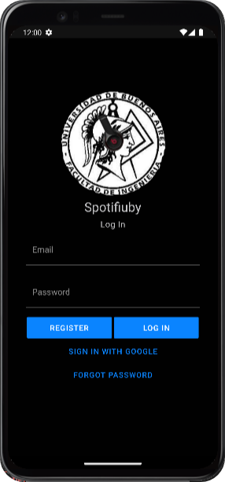

Si no tenes cuenta podes crear una a travez del botón de REGISTER, el cual te llevará a esta pantalla.

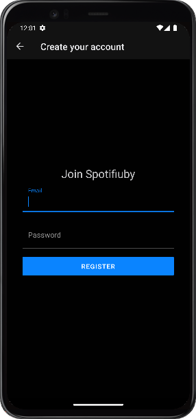

Aca podes ingresar tu mail y contraseña y completar tus datos para crear un usuario.

## **Perfil**

En tu perfil podes modificar tus datos como foto de perfil, nombre de usuario, ubicación y intereses.

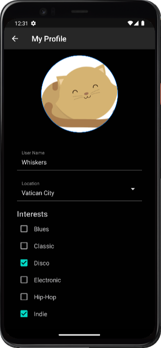

## **Música**

Spotifiuby te acerca la música que más te gusta, disfrutala en tu formato favorito.

### **Canciones**

Encontrá las mejores canciones en nuestra pantalla de canciones.

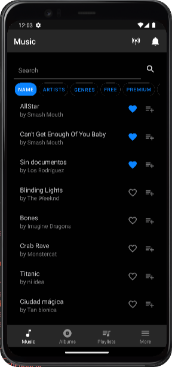 

### **Albums**

Repasá las mejores discografías con la seccion de albums.

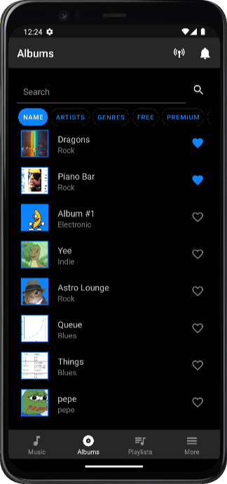

Adentro de los los albums podes ver y escuchar todas sus canciones.

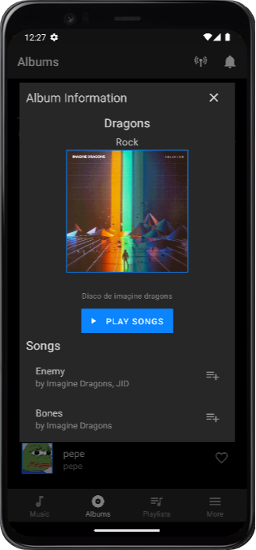

También scrolea y vas a encontrar reseñas y comentarios de otros usuarios, o tuyos.

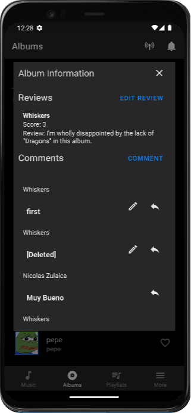

Interactuá con otros usuarios respondiendo a sus comentarios.

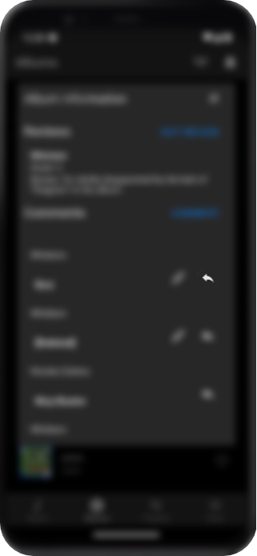

Y se te equivocas, no hay problema siempre podes edit tus comentarios

### **Playlists**

Con spotifiuby podes escuchar playlist hechas por otros usuarios.

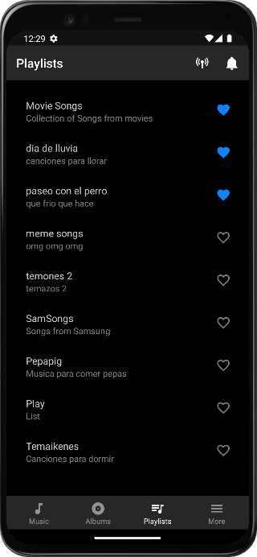 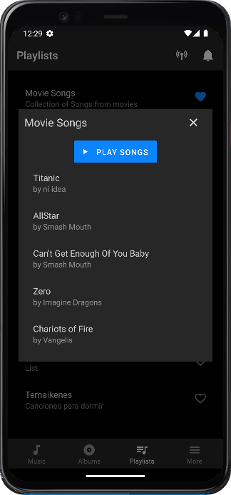

No te pierdas de agregar tus canciones favoritas a tus playlist, solo apreta el siguiente boton en cualquier cancion y agregalo a la playlist que quieras.

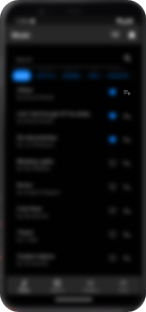 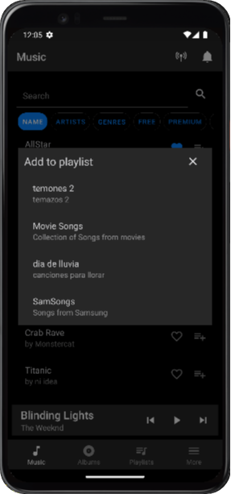

### **Favoritos**

Elejí tus canciones, albums y playlists favoritos usando los corazones a la derecha.

Podes acceder a todo tu contenido favorito en la pantalla de favoritos desde el menu.

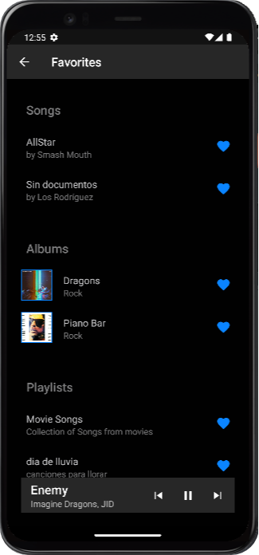

### **Busqueda**

Encontrá canciones y albumes con facilidad gracias a la barra de busqueda. Podes elegír buscar por *nombre*, *artista*, *género* o *nivel de suscripción*.

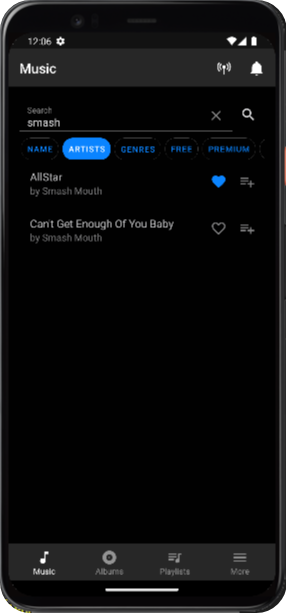 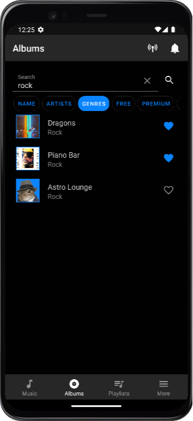

## **Menú**

En la pantalla *more* vas a encontrar todas las opciones y menús que estabas buscando.

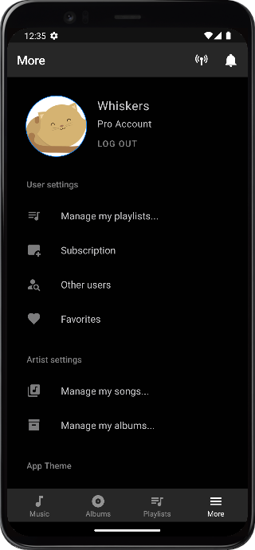

## **Suscripción**

Como usuario tenes la opción de suscribirte a spotifiuby para acceder a más contenido. A traves del botón de *suscription* en el menú elegí entre 4 niveles de suscripción *gratis*, *premium*, *pro* o *god* y tu pago será procesado a traves de la red de ethereum. Las suscripciones son por un plazo de 30 dias.

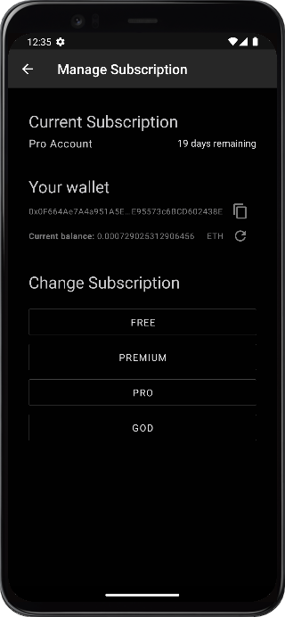 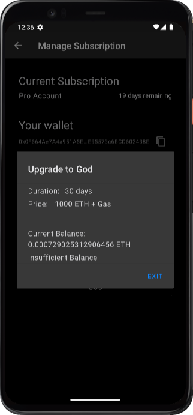

## **Chat**

Compartí la música con tus amigos, podes ver sus perfiles, compartir playlists y incluso chatear con ellos. Todo en de la pantalla *other users* que se accede a traves del menú 

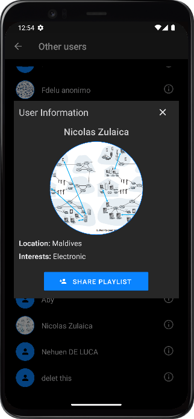 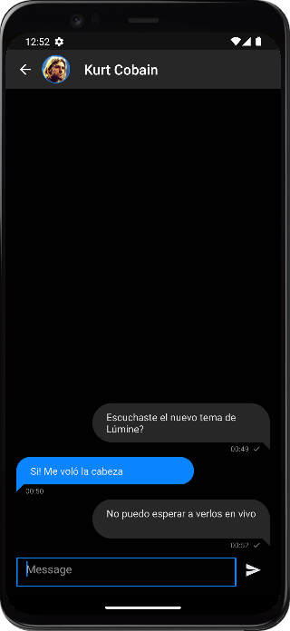

### **Notificaciones**

Para ver todas tus notificaciones podes hacerlo mediante este botón.

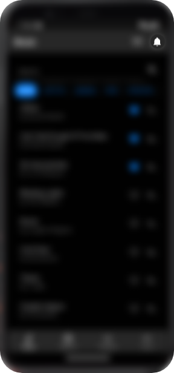

## **Vivos**

Escucha a tus artistas favoritos en vivo en la pantalla de *live streams*.

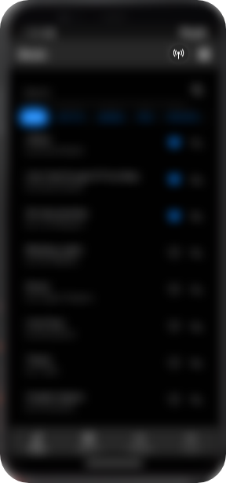 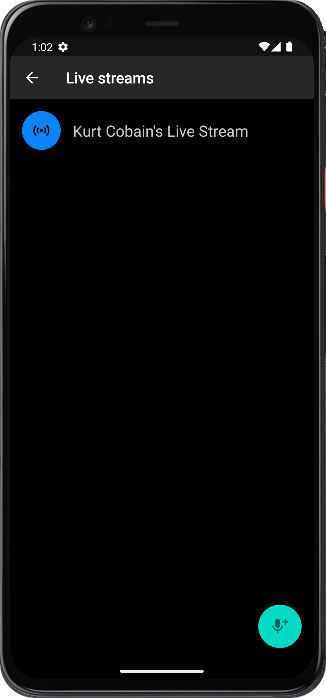

## **Tema**

Elegí el tema que más te guste entre *lígero* y *oscuro* para la app. 

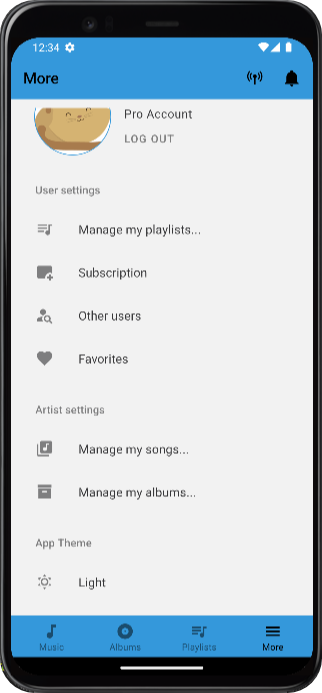 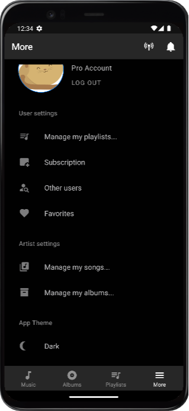

Lo podes cambiar con el botón de temas en el menú.

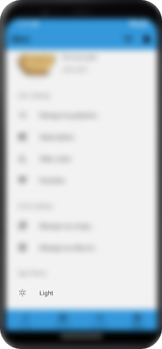

## **Para Artístas**

Como artísta en Spotifiuby podes subir albums, canciones y hasta hacer vivos.

Para controlar tu contenido accedé a las pantallas de *Manage my songs* y *Manage my albums* desde el menú y tocá cualquier canción o album que quieras editar, o incluso crea nuevos a partir del boton de abaljo a la derecha.

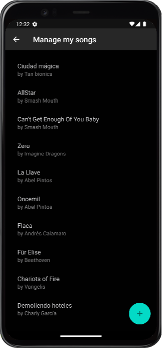 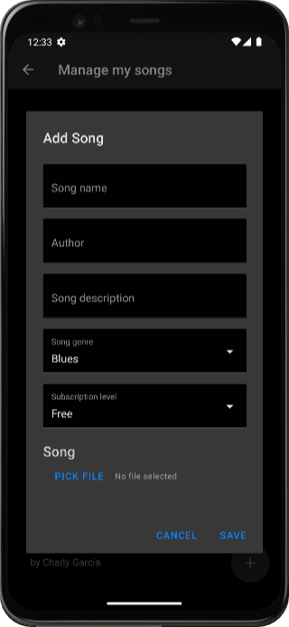

Tampoco te pierdas de hacer vivos para llegar directo a tus fans.

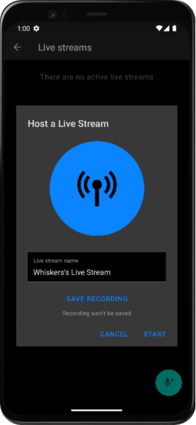

## **Descarga**
Descargate la app a traves de este link. Disponible para android.

[DOWNLOAD](https://github.com/taller2-grupo5-rostov-1c2022/android-app/releases/latest)

