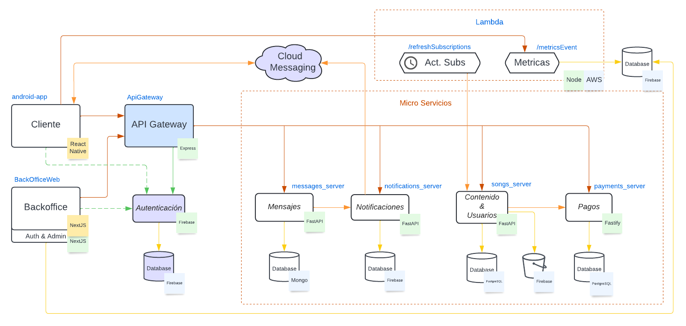

[//]: # "Indice dentro de la pagina, se puede usar los headers #, ##, ###, listas, etc."

  

	Contenidos
  

  {: .text-delta }
1. TOC
{:toc}

# Backend

La aplicación fue desarrollada en una arquitectura de microservicios.

# Arquitectura

# Templates

Varios de los microservicios fueron creados a partir de un [template de FastAPI](https://github.com/taller2-grupo5-rostov-1c2022/fastapi-template), el cual fue evolucionando a medida que se iban
creando los primeros microservicios. Al mismo tiempo, se contó con un [template de Node.js](https://github.com/taller2-grupo5-rostov-1c2022/NodeServer) en el caso de que fuera necesario.

En el [README del repositorio](https://github.com/taller2-grupo5-rostov-1c2022/fastapi-template#readme) se puede ver la lista de componentes, funcionalidades y pasos
para reproducir un mini backend sin perder mucho tiempo.

El uso de un template facilitó mucho el desarrollo de nuevos microservicios y permitió tener rápidamente un walking skeleton funcional. Sin embargo,
es importante aclarar que los dos templates no incluyen ningún tipo de base de datos, es decir, si bien terminamos usando `PostgreSQL` en la mayoría de los
casos, en un comienzo desconocíamos qué tipo de base de datos convenía para cada caso de uso.
